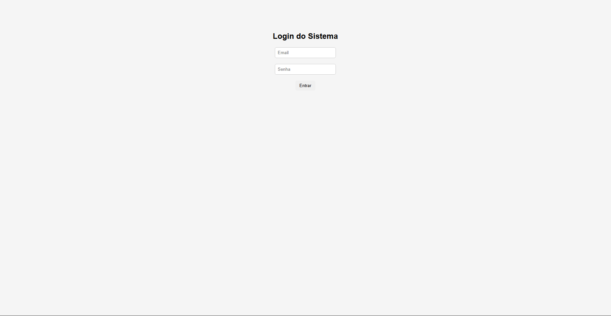
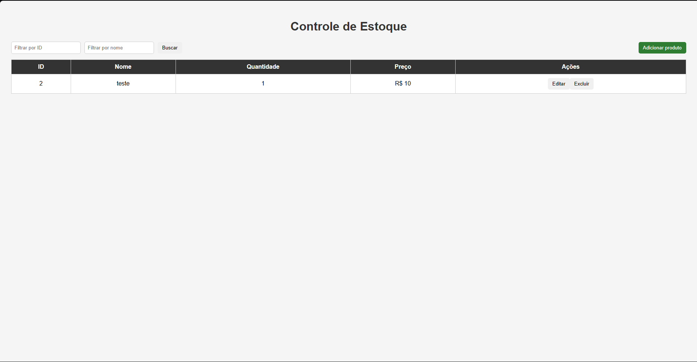

# 💻 Frontend - Controle de Estoque

Interface web desenvolvida em React para consumo da API.

## 🔗 Projeto completo
- Backend: https://github.com/badovb/controle-estoque-java

  ### 🌐 Acesse o sistema
https://estoque-front-two.vercel.app

### ⚙️ Funcionalidades
- Listagem de produtos
- Cadastro e edição
- Exclusão
- Busca
- Tela de login

### 🛠 Tecnologias
- React
- JavaScript
- CSS

### ▶️ Como rodar
npm install
npm start

